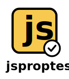

<p align="center">
  
</p>

# jsproptest

`jsproptest` is a property-based testing (PBT) framework for JavaScript and TypeScript, drawing inspiration from libraries such as Haskell's QuickCheck and Python's Hypothesis. Property-based testing shifts the focus from example-based verification to defining universal *properties* or *invariants* that must hold true for an input domain.

Instead of manually crafting test cases for specific inputs, PBT allows you to describe the *domain* of inputs your function expects and the *general characteristics* of the output (e.g., `add(a, b)` should always be greater than or equal to `a` and `b` if they are non-negative). PBT then generates hundreds or thousands of varied inputs, searching for edge cases or unexpected behaviors that violate your defined properties. This approach significantly increases test coverage and the likelihood of finding subtle bugs.

The core workflow involves:

1.  **Defining a property:** A function that takes generated inputs and asserts an expected invariant. See [Properties](properties.md).
2.  **Specifying generators:** Mechanisms for creating random data conforming to certain types or constraints, often built by composing simpler generators using **combinators**. See [Generators](generators.md) and [Combinators](combinators.md).
3.  **Execution:** `jsproptest` automatically runs the property function against numerous generated inputs (typically 100+).
4.  **Shrinking:** If a test case fails (the property returns `false` or throws), `jsproptest` attempts to find a minimal counterexample by simplifying the failing input. See [Shrinking](shrinking.md).

Consider verifying a round-trip property for a custom parser/serializer:

```typescript
import { forAll, Gen } from 'jsproptest';
import { deepStrictEqual } from 'assert'; // Use Node.js assert for deep equality

it('should preserve data after serializing and parsing', () => {
  // Generator for keys (non-empty strings without '&' or '=')
  const keyGen = Gen.string(1, 10).filter(s => s.length > 0 && !s.includes('&') && !s.includes('='));
  // Generator for arbitrary string values
  const valueGen = Gen.string(0, 10);
  // Generator for objects (dictionaries) with our specific keys and values
  const dataObjectGen = Gen.dict(keyGen, valueGen, 0, 10);

  // forAll executes the property check with generated data objects
  forAll(
    (originalData: Record<string, string>) => {
      // Perform the round trip: serialize then parse
      const serialized = serializeMyDataFormat(originalData);
      const parsedData = parseMyDataFormat(serialized);

      // Property: The parsed data must deep-equal the original data object.
      // Using deepStrictEqual ensures type and value equality.
      deepStrictEqual(parsedData, originalData);
    },
    dataObjectGen // Use the dictionary generator
  );
  // jsproptest runs this property multiple times with diverse data objects.
});
```

This PBT approach facilitates the discovery of edge cases and intricate bugs that might be neglected by traditional, example-driven testing methodologies.

## Getting Started

### Installation

To add `jsproptest` to your project, run the following command:

```bash
npm install jsproptest --save-dev
```
This will install the package and add it to your `devDependencies`.

## Core Concepts and Features

Understanding these key components will help you use `jsproptest` effectively:

*   **[Generators](generators.md)**: Produce random data of various types (primitives, containers) according to specified constraints (e.g., `Gen.integer()`, `Gen.array(...)`). Learn how to create the basic building blocks of your test data.

*   **[Combinators](combinators.md)**: Modify or combine existing generators to create new ones. Discover techniques to constraint, combine, and transform generators for complex data structures.

*   **[Properties (`Property`, `forAll`)](properties.md)**: Express conditions or invariants that should hold true for generated data. `jsproptest` runs these properties against many generated examples using the `forAll` function or `Property` class methods. Understand how to define the invariants your code should satisfy and how to run tests.

*   **[Shrinking](shrinking.md)**: When a property fails, `jsproptest` attempts to find a minimal counterexample by simplifying the failing input using logic associated with the generated value (often via a `Shrinkable` structure). See how `jsproptest` helps pinpoint failures.

*   **[Stateful Testing](stateful-testing.md)**: Go beyond simple input-output functions and test systems with internal state by generating sequences of operations or commands. Learn how to model and verify stateful behaviors.
